# Diagrama de Clases — CitasApp (rama `Gof`)

Este diagrama refleja el estado real del proyecto en esta rama: **arquitectura hexagonal**
en 4 capas (`Domain`, `Application`, `Infrastructure`, `Web`) más el patrón de diseño
**Observer** (notificaciones de citas) y las capas de API REST (`CitasApp.api`,
`CitasApp.Api-Calculadora`).

```mermaid
classDiagram
    %% ===== Domain: Modelos =====
    class Paciente {
        +int Id
        +string Nombre
        +string Apellido
        +string Email
        +string Telefono
    }

    class Medico {
        +int Id
        +string Nombre
        +string Apellido
        +string Especialidad
        +string NumeroLicencia
    }

    class Cita {
        +int Id
        +int PacienteId
        +int MedicoId
        +DateOnly Fecha
        +TimeOnly Hora
        +string Motivo
        +string Estado
    }

    %% ===== Domain: Interfaces =====
    class IPacienteRepository {
        <<interface>>
        +ObtenerTodos() List~Paciente~
        +ObtenerPorId(int id) Paciente
    }

    class IMedicoRepository {
        <<interface>>
        +ObtenerTodos() List~Medico~
        +ObtenerPorId(int id) Medico
    }

    class ICitaRepository {
        <<interface>>
        +ObtenerTodos() List~Cita~
        +ObtenerPorPaciente(int pacienteId) List~Cita~
    }

    class ICitaObserver {
        <<interface>>
        +Notificar(Cita cita) void
    }

    class ICalculadoraService {
        <<interface>>
        +Sumar(double a, double b) double
        +Restar(double a, double b) double
        +Multiplicar(double a, double b) double
        +Dividir(double a, double b) double
    }

    %% ===== Infrastructure: Repositorios JSON =====
    class JsonPacienteRepository {
        +ObtenerTodos() List~Paciente~
        +ObtenerPorId(int id) Paciente
    }

    class JsonMedicoRepository {
        +ObtenerTodos() List~Medico~
        +ObtenerPorId(int id) Medico
    }

    class JsonCitaRepository {
        +ObtenerTodos() List~Cita~
        +ObtenerPorPaciente(int pacienteId) List~Cita~
    }

    %% ===== Infrastructure: Observers (patrón Observer) =====
    class EmailObserver {
        +Notificar(Cita cita) void
    }

    class SmsObserver {
        +Notificar(Cita cita) void
    }

    %% ===== Application: Services =====
    class PacienteService {
        -IPacienteRepository _repository
        +ObtenerTodosPacientes() List~Paciente~
        +ObtenerPacientePorId(int id) Paciente
    }

    class MedicoService {
        -IMedicoRepository _repository
        +ObtenerTodosMedicos() List~Medico~
        +ObtenerMedicoPorId(int id) Medico
    }

    class CitaService {
        -ICitaRepository _citaRepository
        -IPacienteRepository _pacienteRepository
        -IMedicoRepository _medicoRepository
        -IEnumerable~ICitaObserver~ _observers
        +ObtenerTodasCitas() List~Cita~
        +ObtenerCitasPorPaciente(int pacienteId) List~Cita~
        +ValidarPaciente(int pacienteId) Paciente
        +ValidarMedico(int medicoId) Medico
        +ConfirmarCita(int citaId) bool
    }

    class CalculadoraService {
        +Sumar(double a, double b) double
        +Restar(double a, double b) double
        +Multiplicar(double a, double b) double
        +Dividir(double a, double b) double
    }

    %% ===== Web: Controllers (MVC) =====
    class PacienteController {
        -PacienteService _service
        +Index() IActionResult
        +Detalle(int id) IActionResult
    }

    class MedicoController {
        -MedicoService _service
        +Index() IActionResult
        +Detalle(int id) IActionResult
    }

    class CitaController {
        -CitaService _service
        -PacienteService _pacienteService
        -MedicoService _medicoService
        +Index() IActionResult
        +PorPaciente(int pacienteId) IActionResult
    }

    %% ===== API REST: Controllers =====
    class CitasController {
        <<ApiController>>
        -CitaService _service
    }

    class PacientesController {
        <<ApiController>>
        -PacienteService _service
    }

    class MedicosController {
        <<ApiController>>
        -MedicoService _service
    }

    class CalculadoraController {
        <<ApiController>>
        -ICalculadoraService _service
    }

    %% ===== Implementaciones =====
    JsonPacienteRepository ..|> IPacienteRepository
    JsonMedicoRepository ..|> IMedicoRepository
    JsonCitaRepository ..|> ICitaRepository
    EmailObserver ..|> ICitaObserver
    SmsObserver ..|> ICitaObserver
    CalculadoraService ..|> ICalculadoraService

    %% ===== Application depende de Domain (repos + observers) =====
    PacienteService --> IPacienteRepository
    MedicoService --> IMedicoRepository
    CitaService --> ICitaRepository
    CitaService --> IPacienteRepository
    CitaService --> IMedicoRepository
    CitaService --> "many" ICitaObserver : notifica

    %% ===== Web depende de Application (Services) =====
    PacienteController --> PacienteService
    MedicoController --> MedicoService
    CitaController --> CitaService
    CitaController --> PacienteService
    CitaController --> MedicoService

    %% ===== APIs REST depende de Application (Services reutilizados) =====
    CitasController --> CitaService
    PacientesController --> PacienteService
    MedicosController --> MedicoService
    CalculadoraController --> ICalculadoraService

    %% ===== Relaciones de datos =====
    Cita "1" --> "1" Paciente : PacienteId
    Cita "1" --> "1" Medico : MedicoId
```

## Notas del estado real

- **Arquitectura hexagonal en 4 capas**: `CitasApp.Domain` (modelos + contratos, sin
  dependencias), `CitasApp.Application` (Services, orquesta la lógica de negocio),
  `CitasApp.Infrastructure` (implementaciones JSON de los repositorios + Observers) y
  `CitasApp.Web` (Controllers MVC, adaptador de entrada).
- **Patrón Observer**: `CitaService.ConfirmarCita()` recorre todos los `ICitaObserver`
  inyectados (`EmailObserver`, `SmsObserver`) y los notifica al confirmar una cita.
- **Dos APIs REST adicionales** (`CitasApp.api` y `CitasApp.Api-Calculadora`) reutilizan
  los mismos `Services` de `Application`, evitando duplicar lógica de negocio entre el
  cliente MVC y los endpoints HTTP.
- La persistencia sigue siendo por archivos JSON (no hay base de datos relacional).
- El proyecto `Citas_App/` (MVC monolítico original, sin capas) permanece en el repo como
  referencia histórica, pero ya no es el punto de entrada activo de esta rama; la
  aplicación web vigente es `CitasApp.Web`.
